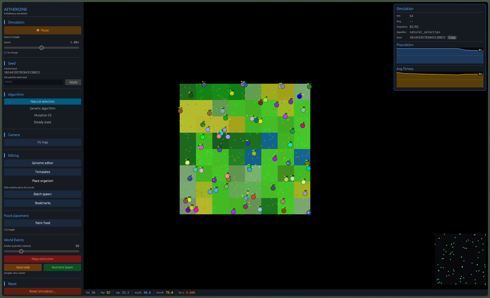

# Aethergene

**Agent-based evolutionary ecosystem simulator — Rust + WebAssembly**

[](https://www.rust-lang.org/)
[](https://webassembly.org/)
[](https://github.com/emilk/egui)
[](https://cannellegrdt.github.io/Aethergene-web/)

[**→ Open live demo**](https://cannellegrdt.github.io/Aethergene-web/)

---



---

## Overview

Aethergene is a discrete-time multi-agent simulation in which thousands of organisms evolve under natural selection across procedurally generated biomes. Each organism carries an explicit genome encoding physiology, behavior, and biome adaptation. The aggregate of individual interactions — foraging, predation, reproduction, territorial signaling — produces emergent phenomena such as speciation events, predator-prey oscillations, and ecological niche partitioning, with no top-down scripting.

The project has two complementary goals:

- **Simulation research** — study emergent ecological and evolutionary dynamics under controlled, reproducible conditions.
- **Algorithm benchmarking** — compare four evolutionary computation strategies (natural selection, genetic algorithm, evolution strategy, steady-state GA) running on identical populations.

The full simulation runs server-side in a headless Rust process. The client is compiled to **WebAssembly** and served as a static bundle on GitHub Pages, communicating with the server over **secure WebSockets (WSS)**.

---

## Highlights

- **Zero runtime dependencies on the client** — pure WASM bundle, no JavaScript framework, no backend calls except the simulation WebSocket.
- **Dual rendering target** — the same egui UI code compiles to a native desktop app (wgpu/Vulkan) and to a browser app (WebGL2) with conditional compilation.
- **Live delta streaming** — the server broadcasts only dirty world zones per frame rather than full state, keeping bandwidth proportional to activity rather than world size.
- **Evolvability** — the mutation rate is itself a gene subject to mutation, allowing populations to evolve their own evolvability.
- **Four interchangeable evolution strategies** — switchable at runtime under a common trait, enabling direct A/B comparisons on live populations.
- **Reproducible experiments** — seeded PRNG, autosave with full binary snapshots (bincode + zstd), and CSV export for offline analysis.

---

## Simulation Model

### Genome encoding

Each organism carries a continuous-valued genome of 11 loci:

| Gene | Effect |
|---|---|
| `speed` | Maximum displacement per tick; scales movement energy cost |
| `size` | Collision radius, attack strength, energy capacity |
| `strength` | Attack damage and combat outcome |
| `metabolism_rate` | Basal metabolic drain per tick |
| `digestion_efficiency` | Fraction of food energy actually absorbed |
| `energy_storage` | Maximum energy reserve |
| `sense_range` | Perception radius for food, predators, and conspecifics |
| `mutation_rate` | Per-locus mutation probability inherited by offspring |
| `sociability` | Threshold for cooperative and territorial behaviors |
| `diet_type` | Herbivore / Carnivore / Omnivore / Scavenger |
| `biome_aptitudes` | Per-biome adaptation scores (0–255) modifying terrain costs and bonuses |

Reproduction is sexual (crossover) or asexual. Crossover operators: uniform, single-point, two-point. Mutations sample from a Gaussian distribution centered on the parent allele value.

### Behavioral decision engine

At each tick each organism resolves a fixed priority hierarchy, biased by its genome:

1. Flee from detected predators (range gated by `sense_range`)
2. Hunt prey (carnivores and omnivores)
3. Forage for food (herbivores, omnivores, scavengers)
4. Reproduce if energy exceeds `reproduction_threshold` (proportional to `energy_storage`)
5. Rest and recover

Social behaviors — cooperative hunting, food sharing, territorial defense — activate when `sociability` exceeds a context-dependent threshold and conspecifics are within `sense_range`.

### Ecological dynamics

- **Speciation** — organisms are clustered into species by genome distance using a nearest-centroid algorithm. A new species is registered when pairwise divergence exceeds the `SPECIATION_THRESHOLD` (0.30). Species labels are stable across tick boundaries.
- **Niche occupancy** — each habitat zone tracks resource contention per dietary guild. Competitive exclusion and niche partitioning emerge organically from resource depletion curves.
- **Food chain logging** — predation events are recorded every 10 ticks; trophic levels and carnivore/herbivore ratios are available for export.
- **Biome effects** — eight biomes (Forest, Plains, Desert, Savanna, Swamp, Mountain, Alpine, Ocean) each apply a distinct modifier matrix to movement cost, sensory attenuation, and metabolic drain, creating persistent selection gradients.

### Environmental dynamics

| Cycle | Period | Effect |
|---|---|---|
| Day / Night | 500 ticks | Night reduces food regeneration by 50% |
| Spring | 5 000 ticks | Food regen ×1.5 |
| Summer | 5 000 ticks | Additional metabolic heat cost |
| Autumn | 5 000 ticks | Food regen ×1.2 |
| Winter | 5 000 ticks | Food regen ×0.3 + cold damage per tick |
| Weather events | Stochastic | Storms, droughts, plagues, nutrient blooms |
| Mass events | Stochastic | Asteroid impacts, nutrient booms, mass extinctions |

---

## Evolution Strategies

Four strategies implement a common `EvolutionStrategy` trait and can be swapped at runtime without restarting the simulation:

| Strategy | Selection pressure | Recombination | Notes |
|---|---|---|---|
| `natural_selection` | Fitness-proportional survival | Asexual + sexual | Baseline — death/birth driven by the energy budget |
| `genetic_algorithm` | Tournament selection (k=3) | Uniform crossover | Explicit generational replacement; population size capped |
| `evolution_strategy` | (μ, λ) or (μ + λ) elitism | Self-adaptive Gaussian mutation | Per-locus step-size adapts via a secondary mutation pass |
| `steady_state` | Worst-individual replacement | Single-point crossover | Continuous population; no generational gap |

The `compare` command runs all four strategies for 10 independent replicates each on identical initial populations, exporting per-tick population size, mean fitness, and genetic diversity index to CSV.

---

## Performance

The server uses a **structure-of-arrays** layout for organism fields, a **spatial hash grid** (60 × 60 cell size) for O(1) average-case neighbor queries, and **Rayon** data-parallel iterators for the per-tick fitness and movement passes.

Representative throughput on a 512 × 512 world (release build, 8 threads):

| Population | Ticks / second |
|---|---|
| 500 | ~2 500 |
| 5 000 | ~300 |
| 50 000 | ~30 |

The network layer broadcasts only dirty zones per frame. On a typical 5 000-organism simulation with moderate activity, this reduces per-frame bandwidth by ~80% compared to a full-state broadcast.

---

## Tech Stack

| Layer | Technology |
|---|---|
| Simulation engine | Rust — safe systems programming, zero-cost abstractions, Rayon parallelism |
| Network server | Tokio async runtime, WebSocket (tokio-tungstenite), bincode binary protocol |
| Web client | WebAssembly (wasm32-unknown-unknown), compiled with Trunk |
| UI framework | egui / eframe — same codebase rendered via wgpu (native) or WebGL2 (browser) |
| Serialization | bincode (binary, network + snapshots) + serde_json (configuration) |
| Snapshot compression | zstd |
| Deployment — server | Docker, OVH VPS, Caddy (automatic TLS + WSS reverse proxy) |
| Deployment — client | GitHub Pages, GitHub Actions CI/CD |

---

## Deployment Architecture

```
      Browser                            VPS OVH
┌───────────────────┐         ┌───────────────────────────┐
│    WASM Client    │         │  Caddy  (TLS termination) │
│   GitHub Pages    │◄─WSS───►│      │                    │
│  (static bundle)  │         │  Aethergene Server :8080  │
└───────────────────┘         │ (Docker, Tokio WS server) │
                              └───────────────────────────┘
```

The client bundle is rebuilt and deployed automatically on every push to `main` via GitHub Actions. The server image is built, transferred, and hot-swapped on the VPS without downtime using `docker compose up -d --no-deps`.
